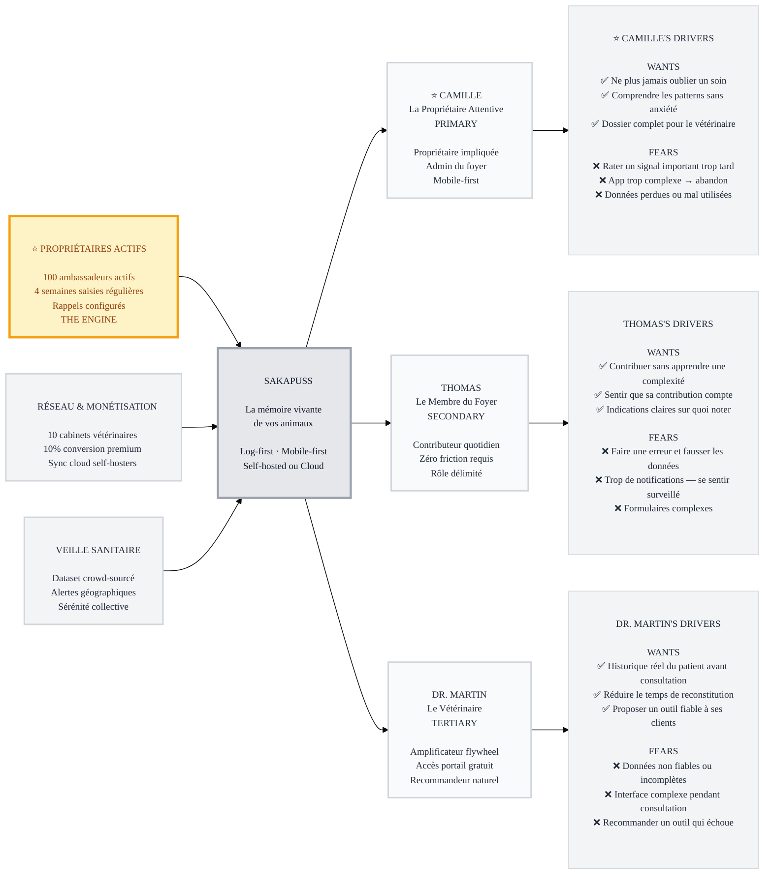

# Trigger Map: Sakapuss

> Vue d'ensemble stratégique — Objectifs business connectés à la psychologie utilisateur

**Created:** 2026-04-07
**Author:** Charchess
**Methodology:** Based on Effect Mapping (Balic & Domingues), adapted for WDS framework

---

## Documents Stratégiques

- **[01-Business-Goals.md](01-Business-Goals.md)** — Vision et objectifs SMART complets
- **[personas/02-Camille-la-Gardienne.md](personas/02-Camille-la-Gardienne.md)** — Persona primaire : La Propriétaire Attentive
- **[personas/03-Thomas-le-Contributeur.md](personas/03-Thomas-le-Contributeur.md)** — Persona secondaire : Le Membre du Foyer
- **[personas/04-Dr-Martin-le-Praticien.md](personas/04-Dr-Martin-le-Praticien.md)** — Persona tertiaire : Le Vétérinaire Praticien
- **[05-Key-Insights.md](05-Key-Insights.md)** — Implications stratégiques et focus design

---

## Vision

**Sakapuss est la mémoire vivante de vos animaux — un hub self-hosted qui transforme les observations quotidiennes du foyer en patterns reconnaissables, pour soigner avec sérénité plutôt qu'avec anxiété.**

---

## The Transformation

**AVANT Sakapuss :** Post-it sur le frigo, Excel qu'on n'ouvre plus, mémoire défaillante, consultations vétérinaires où on ne sait pas répondre, anxiété de fond.

**APRÈS Sakapuss :** Source de vérité unique, rappels proactifs validés, historique qui rassure, vétérinaire avec toutes les infos, sérénité.

---

## The Flywheel

```
⭐ Camille utilise quotidiennement
        ↓
🔗 Recommande à Dr. Martin
        ↓
🌟 Dr. Martin accède (gratuit) → Recommande à ses clients
        ↓
⭐ Nouveaux Camille → Le flywheel se ferme
```

**Priority #1 (THE ENGINE):** Créer des Propriétaires Attentifs Actifs → 100 en 6 mois
**Priority #2 (DRIVEN BY):** Réseau Vétérinaires + Monétisation Premium → 12 mois
**Priority #3 (COMMUNITY):** Veille Sanitaire Collective → 18-24 mois

---

## Trigger Map Visualization



---

## Business Strategy

**THE ENGINE (BG0) :** 100 Propriétaires Actifs en 6 mois. Sans eux, pas de flywheel, pas de données, pas de monétisation.

**Key insight :** La friction zéro à la saisie est la condition #1. Chaque seconde ajoutée au flow de saisie réduit la probabilité de rétention à 4 semaines.

**Key insight :** Le premier rappel validé est le moment de vérité. Camille doit vivre le cycle complet (avant → validation → "prochain dans X mois") pour comprendre la valeur du système.

**Key insight :** Dr. Martin est l'amplificateur gratuit le plus puissant. Sa recommandation vaut 10 publicités payantes. Son accès doit être immédiat, gratuit, et sans friction.

---

## Personas — Profils

### ⭐ Camille la Gardienne (PRIMARY)
Propriétaire de 2 chats, admin du foyer Sakapuss. Post-it sur le frigo aujourd'hui, source de vérité numérique demain. Elle note tout depuis son téléphone, configure les rappels, partage le dossier avec son vétérinaire. Quand elle est convaincue, elle recommande naturellement.

**Drivers clés :** Ne plus oublier un soin · Patterns sans anxiété · Dossier pour le vétérinaire
**Craintes clés :** Rater un signal · App trop complexe · Données perdues

### 🚀 Thomas le Contributeur (SECONDARY)
Membre du foyer, contributeur de bonne foi. Nettoie les caisses, remplit les gamelles, observe les animaux. Contribuera si c'est en 3 secondes. Abandonnera si c'est compliqué.

**Drivers clés :** Contribuer sans apprendre · Contribution visible · Indications claires
**Craintes clés :** Fausser les données · Surveillance par notifications · Formulaires

### 🌟 Dr. Martin le Praticien (TERTIARY)
Vétérinaire en cabinet, 20-30 consultations/jour. Ne cherchera pas Sakapuss de lui-même. Sera convaincu par un dossier patient concret. Recommandera si ça améliore ses consultations.

**Drivers clés :** Historique patient avant consultation · Temps gagné · Outil fiable à recommander
**Craintes clés :** Données non fiables · Interface complexe · Outil qui échoue

---

## Strategic Implications

### Focus Design Principal
**Tout part de Camille.** L'interface doit être optimisée pour son usage quotidien mobile-first. Thomas et Dr. Martin ont des interfaces distinctes, moins prioritaires, mais critiques pour la complétude du système.

### Feature Priority
1. Log-first mobile (grille d'actions rapides)
2. Rappels avec cycle de validation complet
3. Timeline historique et graphiques
4. Portail vétérinaire lecture-seule
5. Onboarding multi-utilisateurs foyer
6. Module analytics corrélations (v2)

### How to Read This Map
- **Left (Business Goals):** Ce que Sakapuss veut accomplir
- **Center (Platform):** Ce que Sakapuss est et fait
- **Right top (Target Groups):** Pour qui Sakapuss est conçu
- **Right bottom (Driving Forces):** Pourquoi ils l'utilisent (ou pas)

---

## Next Steps

- [ ] **Review personas** — Vérifier que Camille, Thomas et Dr. Martin sonnent juste
- [ ] **Phase 3 : UX Scenarios** — Définir les scénarios utilisateurs critiques
- [ ] **Feature Impact Analysis** — Scorer les features existantes par persona
- [ ] **Utiliser pour prioriser** — Chaque décision de design doit servir les drivers de Camille d'abord

---

_Generated with Whiteport Design Studio framework_
_Trigger Mapping methodology credits: Effect Mapping by Mijo Balic & Ingrid Domingues (inUse), adapted with negative driving forces_
